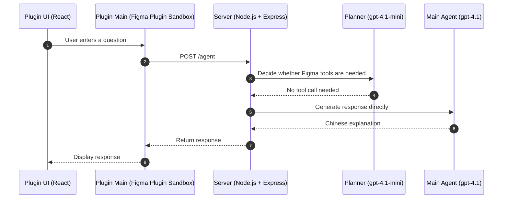
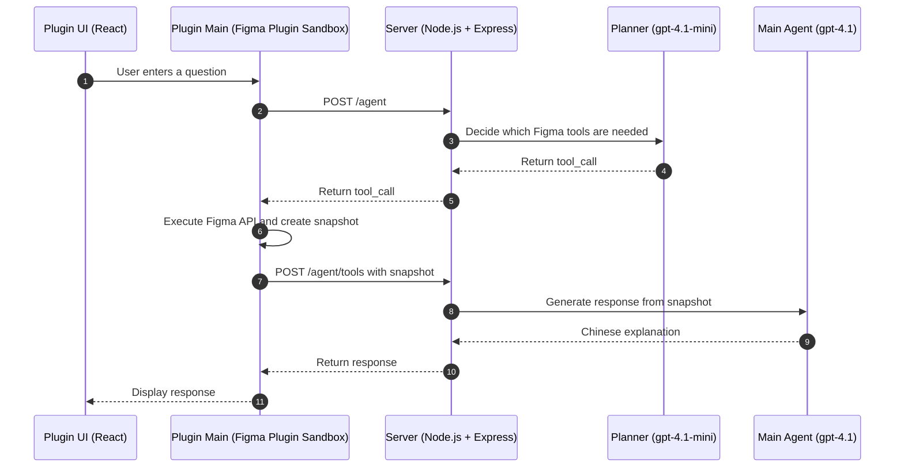

# Lumina

English | [繁體中文](./README.zh-TW.md)

> A conversational AI assistant built for understanding Figma design files

Lumina lets you understand large Figma files with natural language, without manually digging through dozens of pages, frames, and flows.

It is not positioned as a UI generation tool. Instead, it acts as a guide for reading and navigating design files:

- Explain the user flow of the currently selected screen
- Summarize the structure of an entire product design file
- Distinguish happy paths from error paths
- Search for screens and flows related to a specific topic

## Why Lumina?

Large Figma files often come with these problems:

- Flows are scattered across different pages
- Screen names are inconsistent
- New team member onboarding is expensive
- PMs and engineers struggle to quickly understand the full product flow

Lumina combines AI with a Figma plugin to help you directly "read" a design file.

You do not need to know where a screen is. You only need to ask a question.

## Demo

> Demo video placeholders. These can later be replaced with Loom, YouTube, GitHub asset links, or GIFs.

### Current Selection Explanation

<!-- TODO: Add selection explanation demo video or GIF -->

### Full File Overview

<!-- TODO: Add file overview demo video or GIF -->

### Topic-Based Flow Search

<!-- TODO: Add topic search demo video or GIF -->

## Example Questions

| Use case                        | Example question                                                     |
| ------------------------------- | -------------------------------------------------------------------- |
| Explain the current selection   | Please explain the selected screen and organize it into flow steps   |
| Distinguish happy / error paths | Help me identify the happy path and error path in the current screen |
| Full file product overview      | What is this Figma file about? What are the main flows?              |
| Semantic topic search           | Find screens related to subscription across the entire file          |
| Fast onboarding                 | Which core flows should a new engineer understand first?             |

## Architecture Overview

Lumina is composed of three main parts:

- **Plugin UI**: A React chat interface that receives user questions and displays responses
- **Plugin Main**: The Figma Plugin Sandbox layer that calls the server and reads the Figma API
- **Server**: A Node.js + Express server that handles the planner, agent runtime, and OpenAI API calls

Depending on the planner's decision, a conversation can follow one of two paths: without a tool call, or with a tool call.

### Without Tool Call

When the user's question does not require reading Figma file data, the server directly calls the main agent to generate a response.



### With Tool Call

When the user's question requires reading the current selection or scanning the full Figma file, the server first returns a tool call to Plugin Main. Plugin Main then executes the Figma API and sends the resulting snapshot back to the server.



## Figma Tools

Lumina currently provides two core Figma tools:

- **`getCurrentSelectionSnapshot`** — Reads the currently selected frame and returns node names, node types, text snippets, and basic structural information. It is useful for screen explanation, flow analysis, and happy path / error path breakdowns.
- **`scanFileOverview`** — Scans the pages and frames in the current file and creates a structured overview. It is useful for product overviews, cross-flow understanding, and topic-based search.

## Technical Highlights

- **Monorepo + Shared Types** — `packages/shared` defines the protocol types between Plugin and Server. Both sides import from the same source to avoid relying on manually synchronized API contracts.
- **Runtime Contract Validation** — `/agent/tools` validates tool names, args, and result payloads with shared Zod schemas, so the plugin / server boundary does not rely only on TypeScript casts.
- **Planner + Agent Architecture** — A lightweight `gpt-4.1-mini` planner decides whether Figma tools are needed, then `gpt-4.1` generates responses from the actual context. This avoids scanning the entire file on every request.
- **Figma Remote Tools** — Plugin Main owns all Figma API operations. The server only receives structured snapshots, keeping permissions and responsibilities clearly separated.
- **Per-file Session** — The session ID is stored in `figma.root.pluginData`, so conversations are isolated by Figma file and do not leak across files.
- **Modern Figma Plugin Stack** — Built with Vite, TypeScript, React, and Tailwind CSS. The Plugin UI is bundled into a single inline HTML file to fit the Figma Plugin runtime.

## Project Structure

```text
.
├── apps/
│   ├── plugin/
│   │   └── src/
│   │       ├── main/              # Figma plugin sandbox (reads Figma API, calls server)
│   │       │   ├── figmaTools/    # buildSelectionSnapshot, buildFileOverviewSnapshot
│   │       │   ├── agentClient.ts # HTTP client for calling the server
│   │       │   └── session.ts     # Per-file session management
│   │       ├── ui/                # React UI (chat interface)
│   │       │   ├── components/
│   │       │   └── hooks/
│   │       └── shared/            # Plugin-internal postMessage types
│   └── server/
│       └── src/
│           ├── index.ts           # Express entry (/agent, /agent/tools)
│           ├── planner.ts         # Intent planning for deciding whether Figma tools are needed
│           ├── agent.ts           # Main agent that generates Chinese flow explanations
│           ├── runtime.ts         # Single-turn conversation runtime
│           ├── toolResults.ts     # Handles Figma snapshots and calls the agent
│           └── session.ts         # Server-side in-memory sessions
└── packages/
    └── shared/
        └── src/
            ├── agentProtocol.ts   # Plugin ↔ Server HTTP protocol types
            ├── agentTools.ts      # Figma tool definitions and Zod schemas
            └── snapshots.ts       # Snapshot types (SelectionSnapshot, FileOverviewSnapshot)
```

## Local Development

### Prerequisites

- Node.js 18+
- OpenAI API key
- Figma Desktop App

### Install

```bash
npm install

# Build the shared package first so server / plugin can read types and runtime schemas through package exports
npm run build --workspace @lumina/shared
```

### Environment Variables

Copy the server environment example:

```bash
cp apps/server/.env.example apps/server/.env
```

Fill in `apps/server/.env`:

```env
OPENAI_API_KEY=
PORT=8787
DEBUG_LUMINA=false
```

The plugin connects to `http://localhost:8787` by default. If the server uses another URL, set this before building the plugin:

```bash
VITE_SERVER_BASE_URL=http://localhost:8787 npm run build --workspace @lumina/plugin
```

### Start Server

```bash
npm run dev:server
```

The server listens on:

```text
http://localhost:8787
```

### Build Plugin

One-time build:

```bash
npm run build --workspace @lumina/shared
npm run build --workspace @lumina/plugin
```

Development mode requires two terminals:

```bash
npm run dev:plugin:main
```

```bash
npm run dev:plugin:ui
```

### Load Plugin in Figma

1. Open Figma Desktop
2. Go to **Plugins → Development → Import plugin from manifest**
3. Select the root `manifest.json`

## Build

This project currently does not have a root-level `build` script. To build everything, run:

```bash
npm run build --workspace @lumina/shared
npm run build --workspace @lumina/server
npm run build --workspace @lumina/plugin
```

## Code Quality

```bash
# Type check
npm run type:check

# Format + lint checks
npm run check

# Auto-fix
npm run fix
```

## Roadmap

- [ ] Support more Figma tools
- [ ] More complete semantic search
- [ ] Multi-turn flow understanding
- [ ] Component relationship analysis
- [ ] Shared session context for teams
- [ ] RAG-based large file indexing
