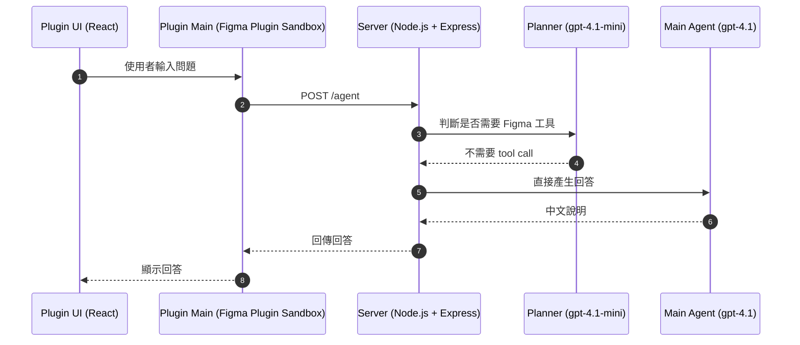
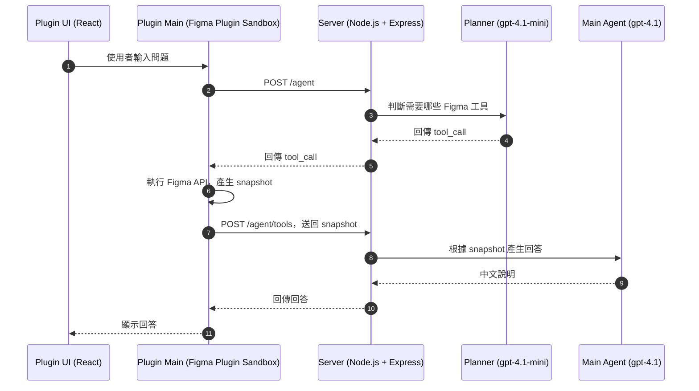

# Lumina

> 專為 Figma 設計檔打造的對話式 AI 助理

Lumina 讓你可以直接用自然語言理解大型 Figma 設計檔，而不用手動翻找數十個 Page、Frame 與 Flow。

它的定位不是生成 UI，而是作為你的「設計檔案導覽員」：

- 解釋目前畫面的使用流程
- 整理整份產品設計檔的架構
- 區分 Happy Path / Error Path
- 依主題搜尋相關畫面與流程

## 為什麼需要 Lumina？

大型 Figma 檔案通常會遇到這些問題：

- Flow 分散在不同 Page
- 畫面命名不一致
- 新成員 onboarding 成本高
- PM / Engineer 很難快速理解完整產品流程

Lumina 透過 AI + Figma Plugin，協助你直接「閱讀」設計檔。

你不需要知道畫面在哪，只需要提出問題。

## 可以問哪些問題？

| 使用情境                | 範例問題                                    |
| ----------------------- | ------------------------------------------- |
| 解釋目前選取畫面        | 請解釋目前選取的畫面，整理成流程步驟        |
| 區分 Happy / Error Path | 幫我指出目前畫面的 Happy Path 與 Error Path |
| 整份檔案產品總覽        | 這個 Figma 檔案在做什麼？有哪些主要流程？   |
| 語意搜尋特定主題        | 幫我找整個檔案裡跟 subscription 相關的畫面  |
| 快速 onboarding         | 新工程師需要先理解哪些核心流程？            |

## 架構總覽

Lumina 的核心由三個部分組成：

- **Plugin UI**：React 聊天介面，負責接收使用者問題並顯示回答
- **Plugin Main**：Figma Plugin Sandbox，負責呼叫 Server 與讀取 Figma API
- **Server**：Node.js + Express，負責 Planner、Agent 流程控制與 OpenAI API 呼叫

依照 Planner 判斷結果，對話流程會分成兩種：不需要 tool call，以及需要 tool call。

### 不需要 tool call

當使用者問題不需要讀取 Figma 檔案資料時，Server 會直接呼叫 Main Agent 產生回答。



### 需要 tool call

當使用者問題需要讀取目前選取畫面或掃描整份 Figma 檔案時，Server 會先回傳 tool call 給 Plugin Main，由 Plugin Main 執行 Figma API 後，再把 snapshot 送回 Server。



## Figma Tools

Lumina 目前提供兩個核心 Figma 工具：

- **`getCurrentSelectionSnapshot`** — 讀取目前選取的 Frame，回傳節點名稱、類型、文字片段與基本結構資訊，適合用於畫面解釋、流程分析、Happy Path / Error Path 拆解。
- **`scanFileOverview`** — 掃描整個檔案的 Page / Frame，產生結構化總覽，適合用於產品總覽、跨 Flow 理解與特定主題搜尋。

## Technical Highlights

- **Monorepo + Shared Types** — `packages/shared` 定義 Plugin ↔ Server 的協議型別，兩端 import 同一份型別來源，避免 API contract 只靠人工約定。
- **Runtime Contract Validation** — `/agent/tools` 會用 shared Zod schema 驗證 tool name、args 與 result payload，避免 plugin / server 邊界只依賴 TypeScript cast。
- **Planner + Agent 雙層架構** — 使用輕量的 `gpt-4.1-mini` 判斷是否需要 Figma 工具，再由 `gpt-4.1` 根據實際上下文產生回答，避免每次都掃描整份檔案。
- **Figma Remote Tools** — Plugin Main 負責所有 Figma API 操作，Server 只接收結構化 snapshot，讓權限邊界與職責切分更清楚。
- **Per-file Session** — Session ID 儲存在 `figma.root.pluginData`，不同 Figma 檔案會自動隔離對話上下文，避免跨檔案混淆。
- **Modern Figma Plugin Stack** — 使用 Vite、TypeScript、React 與 Tailwind CSS 建置，並將 Plugin UI 打包成單一 HTML inline bundle，符合 Figma Plugin runtime 限制。

## 專案結構

```text
.
├── apps/
│   ├── plugin/
│   │   └── src/
│   │       ├── main/              # Figma plugin sandbox（讀取 Figma API、呼叫 server）
│   │       │   ├── figmaTools/    # buildSelectionSnapshot、buildFileOverviewSnapshot
│   │       │   ├── agentClient.ts # HTTP client，呼叫 server
│   │       │   └── session.ts     # Per-file session 管理
│   │       ├── ui/                # React UI（聊天介面）
│   │       │   ├── components/
│   │       │   └── hooks/
│   │       └── shared/            # Plugin 內部 postMessage 型別定義
│   └── server/
│       └── src/
│           ├── index.ts           # Express 入口（/agent、/agent/tools）
│           ├── planner.ts         # 意圖判斷，決定是否需要 Figma 工具
│           ├── agent.ts           # 主 Agent，產生中文流程說明
│           ├── runtime.ts         # 單輪對話流程控制
│           ├── toolResults.ts     # 處理 Figma snapshot，組 prompt 並呼叫 Agent
│           └── session.ts         # Server 端 in-memory session
└── packages/
    └── shared/
        └── src/
            ├── agentProtocol.ts   # Plugin ↔ Server HTTP 協議型別
            ├── agentTools.ts      # Figma 工具定義與 Zod schema
            └── snapshots.ts       # Snapshot 型別（SelectionSnapshot、FileOverviewSnapshot）
```

## 本地開發

### 前置條件

- Node.js 18+
- OpenAI API Key
- Figma Desktop App

### 安裝

```bash
npm install

# 先建立 shared 套件，讓 server / plugin 可以透過 package exports 讀到型別與 runtime schema
npm run build --workspace @lumina/shared
```

### 設定環境變數

複製 server 範例環境變數：

```bash
cp apps/server/.env.example apps/server/.env
```

在 `apps/server/.env` 填入：

```env
OPENAI_API_KEY=
PORT=8787
DEBUG_LUMINA=false
```

Plugin 預設會連到 `http://localhost:8787`。如果 server 改用其他 URL，build plugin 前可設定：

```bash
VITE_SERVER_BASE_URL=http://localhost:8787 npm run build --workspace @lumina/plugin
```

### 啟動 Server

```bash
npm run dev:server
```

Server 預設監聽：

```text
http://localhost:8787
```

### Build Plugin

一次性 build：

```bash
npm run build --workspace @lumina/shared
npm run build --workspace @lumina/plugin
```

開發模式需要兩個 terminal：

```bash
npm run dev:plugin:main
```

```bash
npm run dev:plugin:ui
```

### 在 Figma 載入 Plugin

1. 開啟 Figma Desktop
2. 前往 **Plugins → Development → Import plugin from manifest**
3. 選取專案根目錄的 `manifest.json`

## Build

此專案目前沒有 root-level `build` script。完整 build 可依序執行：

```bash
npm run build --workspace @lumina/shared
npm run build --workspace @lumina/server
npm run build --workspace @lumina/plugin
```

## 程式碼品質

```bash
# 型別檢查
npm run type:check

# 格式化 + Lint 檢查
npm run check

# 自動修復
npm run fix
```

## Roadmap

- [ ] 支援更多 Figma tools
- [ ] 更完整的 semantic search
- [ ] 多輪 Flow 理解
- [ ] 支援 component relationship 分析
- [ ] 支援多人共享 session context
- [ ] RAG-based large file indexing
